# <-----[  **IMPORTANT NOTES** ]-----> 
***


#### the trigger word to wake up my bot is `golem`. Any other word or combination of my bot's name will fail.


#####Also, it is listening on ***all*** public channels (hence including the #bots channel, as per the assignment requirements)

The following is an example of ***waking it up***, in the way described above:


Secondly, ***when referring to my bot in a public channel, then use the `@ahsan_bot` handle***, as shown in the pictures in the following testing section. Do not attempt to use its full name or any combination of it. 

***Note that all such behaviour has been pre-approved by the relevant authorities.***


***

# <-----[ ***ON TESTING*** ]----->

(PHOTOS BELOW)

Note that the `imgs` directory in this repository has a `testing` subdirectory, which further has several subdirectories, as shown in the overall directory structure below:

```
├── imgs
│   ├── jackjack_is_a_jerk.png
│   ├── jackjack_speaks.png
│   ├── sample_yelp.png
│   ├── slack_bot_add.png
│   └── testing
│       ├── hello
│       │   └── 1.png
│       ├── map_EXTRA_CREDIT
│       │   ├── 1.png
│       │   ├── 2.png
│       │   ├── 3.png
│       │   ├── 4.png
│       │   ├── 5.png
│       │   ├── 6.png
│       │   ├── 7.png
│       │   └── 8.png
│       ├── random_input
│       │   ├── 1.png
│       │   └── 2.png
│       ├── weather_EXTRA_CREDIT
│       │   ├── 1.png
│       │   └── 2.png
│       └── yelp
│           ├── 1.png
│           └── 2.png

```

Note that each of these subdirectories of the `imgs/testing` directory contain photos showing tests run on one specific aspect of my slack bot's functionality. Thus, the `imgs/testing/hello` folder contains an image showing rudimentary 'hello' messages being sent to my bot, and the bot's corresponding reply. The image is shown here:
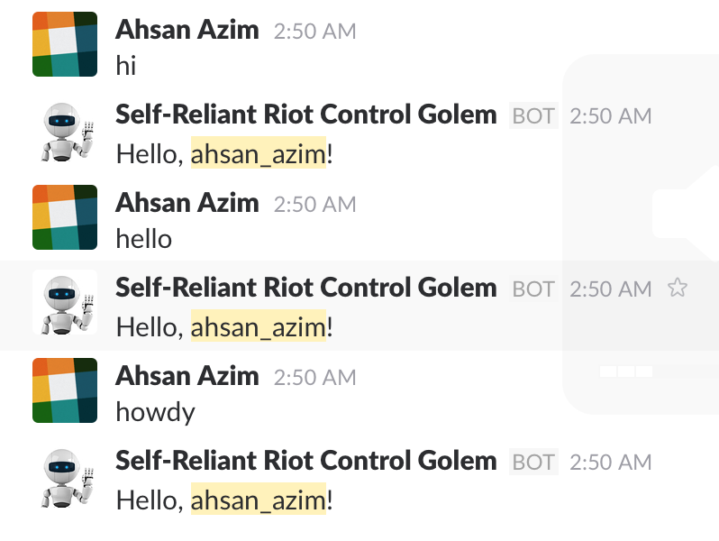

Similarly, the `imgs/testing/random_input` folder shows the result of entering jibberish (i.e. any text that my bot was not hard coded to be able to specifically able to respond to). Clearly, my bot responds appropriately to such situations, and in style matching that required in the specs. This is shown here:
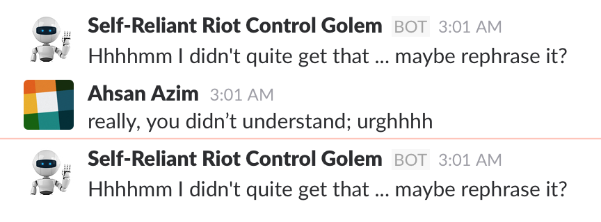
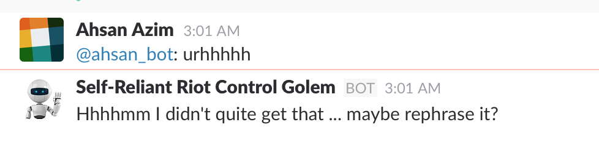

Moving on to the `imgs/testing/yelp` directory - here I show a yelp query that can be performed via my bot, and the bot's subsequent reply with suggestions. Note that although there were indeed 10 restaurants showing up in the results, here I did not include the remaining 2 or 3 in the photo, since that would have been rather repetitive. This is shown here:

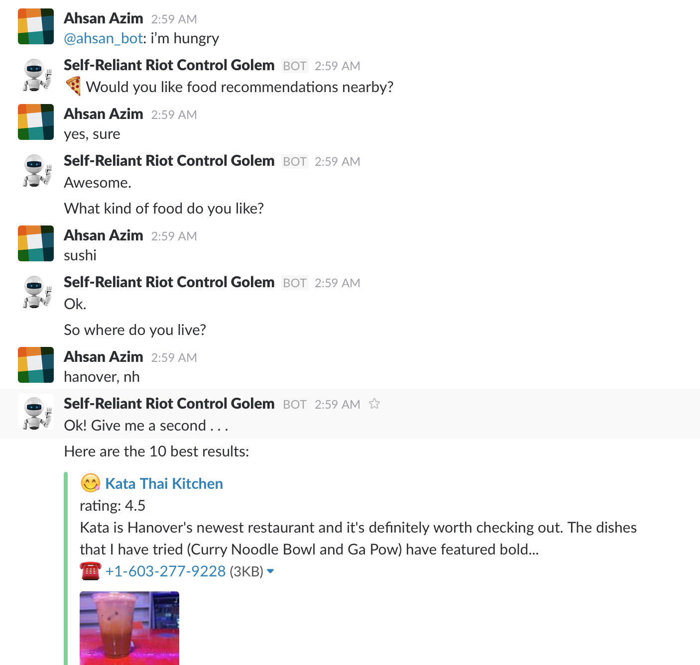
and
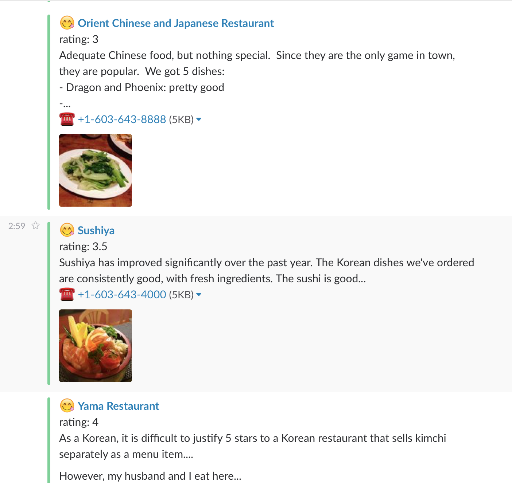

Now there are the two subdirectories containing proof of testing my **Extra Credit** Implementations:

- `imgs/testing/weather_EXTRA_CREDIT` : shows proof that my bot responds appropriately by allowing the user to obtain the current weather of any location in the world, and in a nicely formatted way at that. Here the Open Weather API was used. This is shown here:
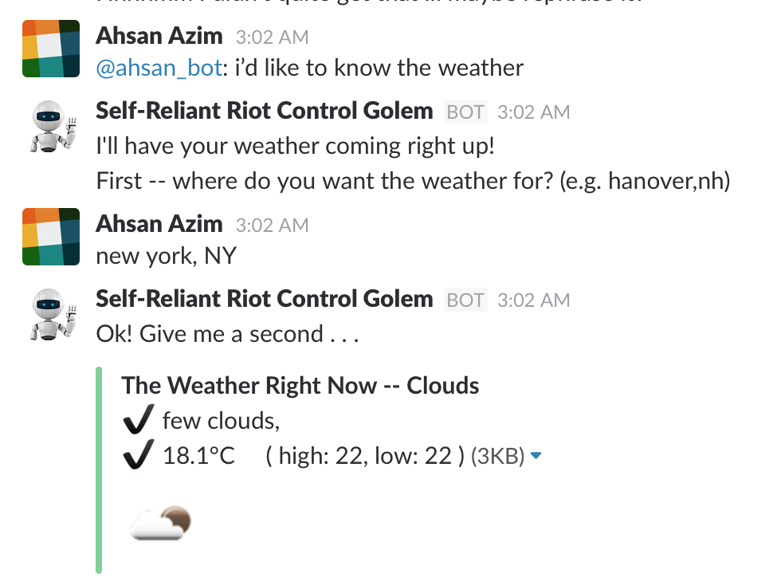
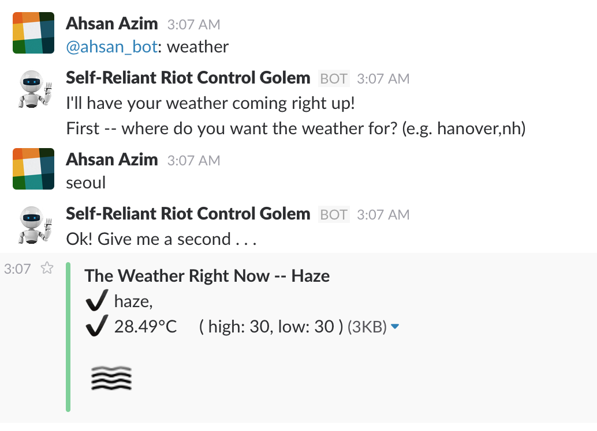

- `imgs/testing/map_EXTRA_CREDIT` shows proof that my bot responds appropriately by allowing the user to obtain various types of map of any location in the world. Here the Google Static Maps API was used. This is shown here:

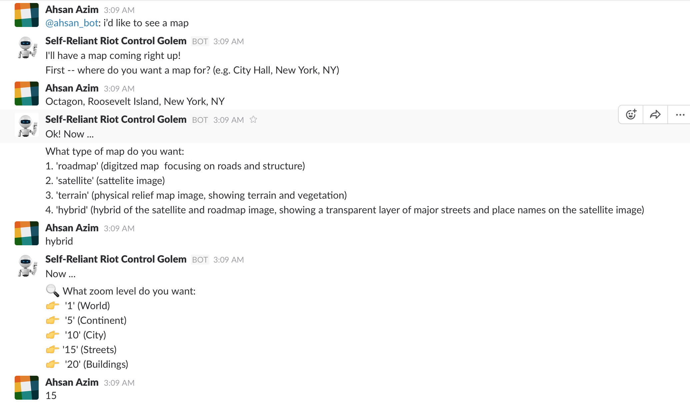
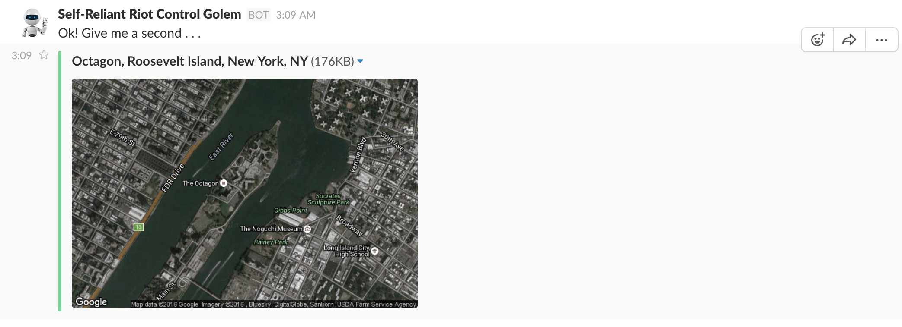
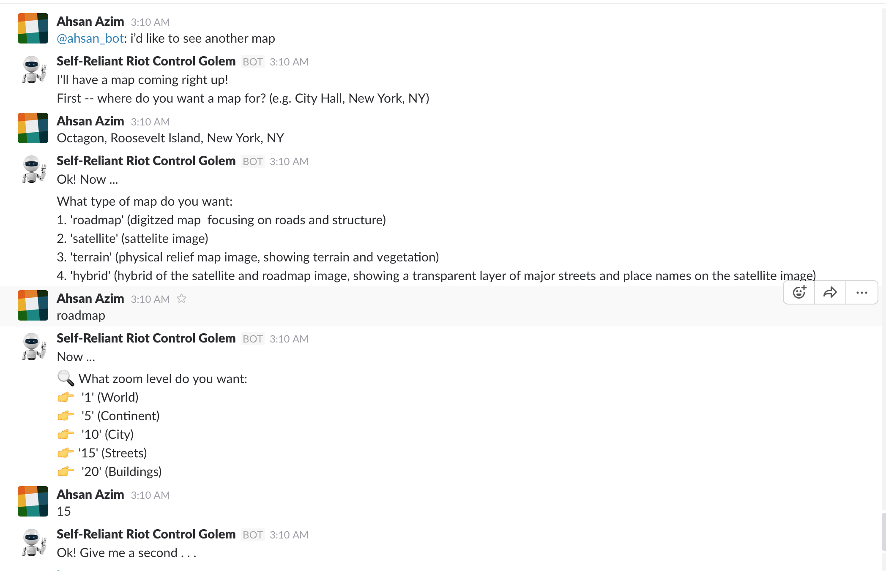
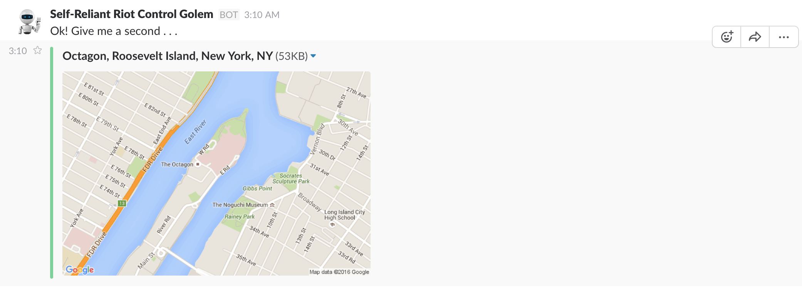
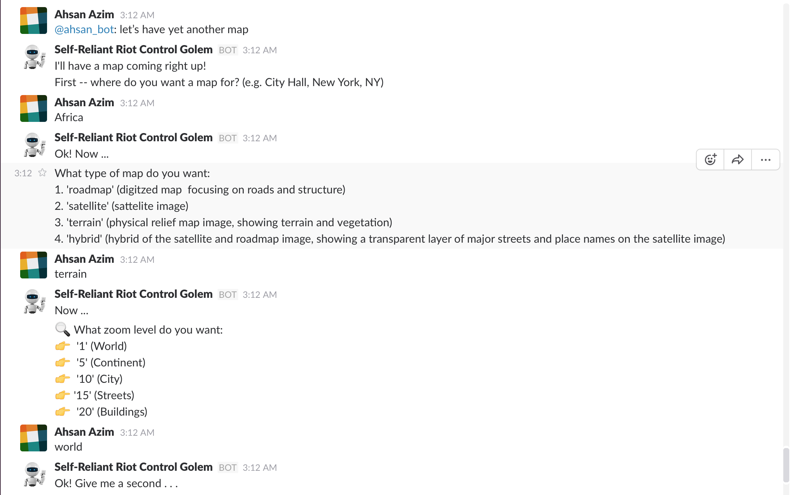
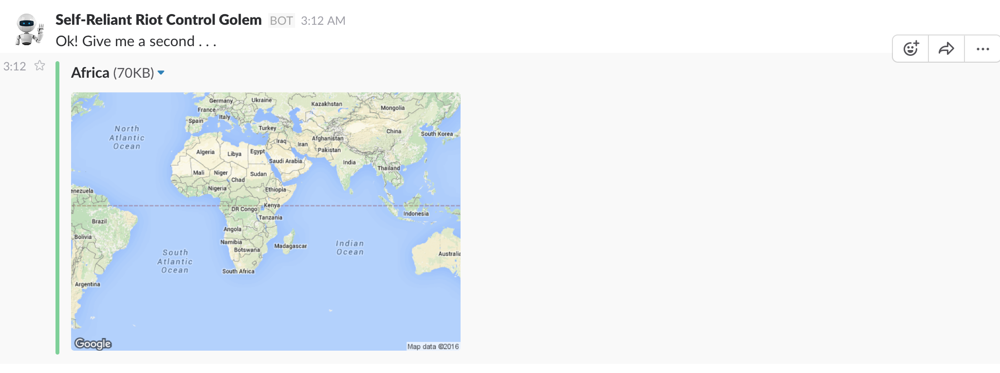
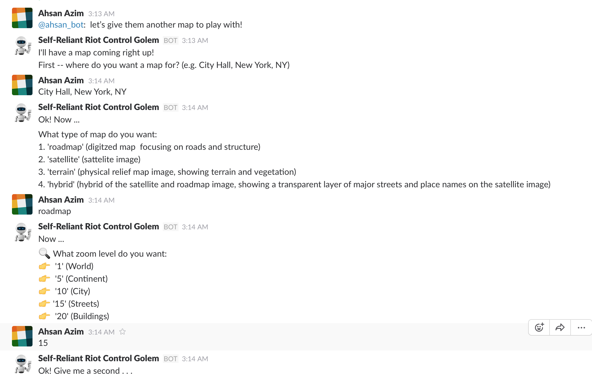
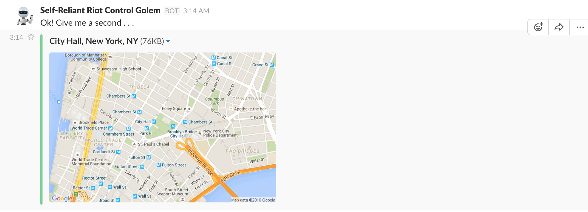

**ALSO NOTE that in all of these subdirectories, the photos are numbered - this is intentional, since the photos are intended to be viewed in ascending order (look at photo `1.png`, then `2.png`, and so on ...)**
